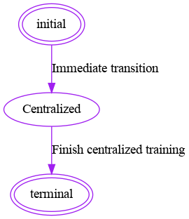
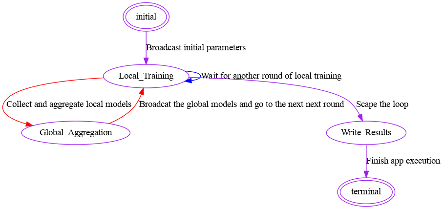

# app-four:  FeatureCloud Template with predefined four states 

The app-four template contains four states for federated scenario, hence, we call it `app-four`. Using App-four template,
developers can maximally focus on  developing app-specific operations rather than general federated features and services.
 

For registering and testing your apps or using other apps, please visit
[FeatureCloud.ai](https://featurecloud.ai/). And for more information about FeatureCloud architecture,
please refer to 
[The FeatureCloud AI Store for Federated Learning in Biomedicine and Beyond](https://arxiv.org/abs/2105.05734) [[1]](#1).
## How it works
In general, app four supports three scenarios (Centralized, Simulation, and Federated) in two modes (Native and Containerized)
by automatically instantiating and running MyApp. Developers should implement their applications in MyApp class 
which has five methods; except for `centralized` which is dedicated for centralized training, all other predefined
methods will be called in corresponding predefined states.
### Centralized training
For centralized training, the app will imediately transition from `initial` state to `Centralized`, run the MyApp.centralized
method, and then transition to terminal.



### Federated 
For federated learning, the app executes the following states:
1. initial: App runs the `MyApp.load_data` method, and broadcasts the returned values of the coordinator to all clients.
2. local training: App runs the `MyApp.local_training` method, and sends the returned values to coordinator.
3. global aggregation: App runs the `MyApp.global_aggregation` method, and broadcasts the returned values to clients.
4. write results: App runs the `MyApp.write_results` method.
5. terminal: App execution finishes



### Modes
FeatureCloud application are primarily designed and implemented to be used in federated workflows on real-world scenarios.
However, for app developers, it would be convenient to implemenyt and test their applications natively, and without containerization.
Therefore, App-four supports tow execution modes to facilitate the app development by supporting most of the functionalities natively.
We suggest, app developers, first develop and test their applications natively, and then test it in containerized mode. 
The modes are completely transparent and one can run the app with terminal without building the docker images. On the other hand, 
they can run their apps using testbed and workflow in containerized mode. 

#### Native
All codes will be run natively, simply by running `python3 main.py` In this mode, no SMPC is supported and required communications
will be handled internally without passing any data on network.
#### Containerized
The app will be executed through the FeatureCloud controller and all the communications passes the controller.
Every app instance will be executed as docker container, where has its own mounted drives. All the functionalities are supported.   

### Scenarios
App-four template supports three scenarios to cover all needs of app developers:
* Centralized: to implement and test centralized model in both modes. Many of the implemented methods, classes, etc., can be used
for both centralized and federated.
* Simulation : it is a federated scenario that can be run in both modes. For containerized, there will be only 
one container instance (one client) that simulates and runs all the clients.
* Federated: Real-world scenario with completetly independent app container instances for clients.

All the scenarios are covered in the config file; once there are no centralized or simulation in the config file,
federated scenario will be executed.

## App development
One should start the development with implementing MyApp class, which is inherits FeatureCloudApp.
```python
class MyApp(utils.FeatureCLoudApp):

    def __init__(self, **kwargs):
        super().__init__(**kwargs)
        self.last_round = False

    def load_data(self):
        return self.last_round

    def local_training(self, global_parameters):
        self.last_round = global_parameters
        return [None]

    def global_aggregation(self, local_parameters):
        self.last_round = True
        return self.last_round

    def write_results(self):
        pass

    def centralized(self):
        pass

```
### Methods
#### Federated
Four methods of `load_data`, `local_training(self, global_parameters)`, `self.last_round = global_parameters`,
`global_aggregation(self, local_parameters)`, and `def write_results` should be implemented.
##### Training loop
the app starts the training loop by transitioning to locat_training state. Then, for every communication round,
coordinator (one of the clients), will transition to aggregate state, runs the aggregation method and broadcasts 
the global parameters to clients. Meantime, other clients, will wait for global parameters in the local training state.
All the transitions and data communication happens automatically. However, developers should expect to receive the global 
parameters and local models as input for corresponding methods.

To break the loop and move to `write_results` method, developers should turn the `last_round` attribute to `True`. 

### Data access
Data will be in different locations, therefore, users should give the path to folder containing data in the config file for centralized and simulation scenario.
For federated scenario, data will be uploaded in a workflow, or path will be provided in the testbed. However, the data root path is different for Native and Containerized mode. 
Developers should use `self.input_root_dir` and `self.output_root_dir` to access the data. 

```python
path_to_train = f"{self.input_root_dir}/{self.config['local_dataset']['train']}"
```
This example not only shows how to access the data, but shows how one can access the content of config.yml file inside the app.

In a similar fashion, one can handle the output data with this consideration that the app execution in native mode
overrides the output directory.

### building the app docker image
Once app implementation is done, building the docker image for testing or adding it to
[FeatureCloud AI store](https://featurecloud.ai/ai-store?view=store&q=&r=0),
developers should provide the following files.
#### Dockerization files

For dockerizing apps, regardless of their applications, there should be some specific files:

1. [Dockerfile](Dockerfile)
2. [server-config](server_config)
   - [docker-entrypoint.sh](server_config/docker-entrypoint.sh)
   - [nginx](server_config/nginx)
   - [supervisord.conf](server_config/supervisord.conf)

Developers should ensure that these files with the same structure and content exist in the same directory as their app
implementation. 


#### App-specific files
All app-specific files should include data or codes strictly dependent on the app's functionality.

##### main.py
Each app should be implemented in a directory that includes the [`main.py`](main.py) file, which in turn comprises either direct
implementation of states or importing them. Moreover, `main` should import `bottle` and `api` packages:
```angular2html
from bottle import Bottle

from api.http_ctrl import api_server
from api.http_web import web_server

import apps.examples.dice

from engine.app import app

server = Bottle()
```
One can implement desired states in [`states.py`](myapp.py) and import it, which because of putting 
[`app_state`](https://github.com/FeatureCloud/FeatureCloud/tree/master/FeatureCloud/app/engine/README.md#registering-states-to-the-app-app_state) on top of state classes, 
merely importing the states and registering them into the [`app` instance](https://github.com/FeatureCloud/FeatureCloud/tree/master/FeatureCloud/app/engine/README.md#app-instance).     

For running the app, inside a docker container, [`app.register()`](https://github.com/FeatureCloud/FeatureCloud/tree/master/FeatureCloud/app/engine/README.md#registering-all-transitions-appregister)
should be called to register and verify all transitions; next, api and servers should mount at corresponding paths; and finally
the server is ready to run the app.

```angular2html
    app.register()
    server.mount('/api', api_server)
    server.mount('/web', web_server)
    server.run(host='localhost', port=5000)
```

All of the codes above, except for importing the app or, alternatively, implementing states, can be exactly same for all apps.  

##### requirements.txt
for installing required python libraries inside the docker image, developers should provide a list of libraries in [requirements.txt](requirements.txt).
Some requirements are necessary for the FeatureCloud library, which should always be listed, are:
```angular2html
bottle
jsonpickle
joblib
numpy
bios
pydot
pyyaml
```

And the rest should be all other app-required libraries.

##### config.yml
Each app may need some hyper-parameters or arguments that the end-users should provide. Such data should be included
in [`config.yml`](https://github.com/FeatureCloud/FeatureCloud/tree/master/FeatureCloud/app#config-file-configyml), which should be read and interpreted by the app. 

### Run YOUR_APPLICATION

#### Prerequisite

To run YOUR_APPLICATION, you should install Docker and FeatureCloud pip package:

```shell
pip install featurecloud
```

Then either download YOUR_APPLICATION image from the FeatureCloud docker repository:

```shell
featurecloud app download featurecloud.ai/YOUR_APPLICATION
```

Or build the app locally:

```shell
featurecloud app build featurecloud.ai/YOUR_APPLICATION
```

Please provide example data so others can run YOUR_APPLICATION with the desired settings in the `config.yml` file.

#### Run YOUR_APPLICATION in the test-bed

You can run YOUR_APPLICATION as a standalone app in the [FeatureCloud test-bed](https://featurecloud.ai/development/test) or [FeatureCloud Workflow](https://featurecloud.ai/projects). You can also run the app using CLI:

```shell
featurecloud test start --app-image featurecloud.ai/YOUR_APPLICATION --client-dirs './sample/c1,./sample/c2' --generic-dir './sample/generic'
```


### References
<a id="1">[1]</a> 
Matschinske, J., Späth, J., Nasirigerdeh, R., Torkzadehmahani, R., Hartebrodt, A., Orbán, B., Fejér, S., Zolotareva,
O., Bakhtiari, M., Bihari, B. and Bloice, M., 2021.
The FeatureCloud AI Store for Federated Learning in Biomedicine and Beyond. arXiv preprint arXiv:2105.05734.
